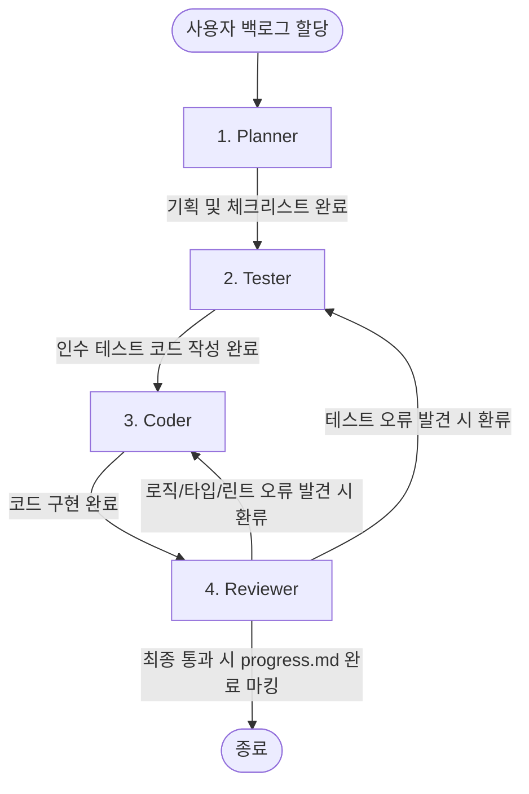

# Harness Multi-Agent System (에이전트 협업 지침서)

본 프로젝트는 4종의 고유 라이브 에이전트(Planner, Tester, Coder, Reviewer)와 1종의 사후 개선 에이전트(Updater)가 상호 유기적으로 결합하여 TDD 기반의 코드 작성 및 검증을 수행하는 하네스(Harness) 시스템입니다.

본 지침서는 하네스 시스템을 새 프로젝트인 `Yeolo-AI`에 이식하고 에이전트들을 안전하게 구동시키기 위한 협업 흐름과 전체 프로젝트 디렉토리 구조를 규정합니다.

---

## 프로젝트 환경 설정 (Project Customization)

하네스를 구동하기 전에, 대상 프로젝트의 환경에 맞춰 아래 가변 설정 인자들을 에이전트 시스템에 올바르게 매핑해야 합니다:

- **대상 프로젝트 기술 스택**: `Python 3.14+ / uv / FastAPI / LangChain / pytest / ruff`
- **소스코드 경로**: `app/` (FastAPI 기반 백엔드 및 AI 에이전트 서비스)
- **테스트코드 경로**: `tests/` (pytest 테스트 코드)
- **개발 명세 보관소**: `.agents/Yeolo-SPEC/` (요구사항, 기능, 도메인, API 기획 보관소)
- **검증 명령어 세트**:
  - 스타일 검사: `uv run ruff check .`
  - 타입 검사: `uv run ruff check .` (정적 코드 분석 겸용)
  - 단위 테스트: `uv run pytest`

---

## 프로젝트 전체 디렉토리 구조 (Overall Project Directory Structure)

하네스 시스템이 대상 프로젝트에 삽입될 때 구축되는 전체 프로젝트 레이아웃입니다. 하네스의 코어 소스들은 대상 프로젝트 루트 하위의 `.agents/` 디렉토리에 통합 보관되어 구동됩니다:

```
Yeolo-AI (대상 프로젝트 루트)
├── app/                      (프로덕션 로직 컴포넌트 및 서비스 코드)
├── tests/                    (인수/단위 테스트 코드)
├── .agents/Yeolo-SPEC/       (Given-When-Then 요구사항 및 기능 명세서 보관소)
├── .agents/                  (하네스 시스템 코어 패키지)
│   ├── agents/               (에이전트별 시스템 프롬프트: planner.md, tester.md 등)
│   ├── hooks/                (초기화 및 빌드 검증 셸 스크립트: init.sh, test.sh)
│   ├── skills/               (진척도 및 리뷰 포맷 확장 스킬 가이드 SKILL.md들)
│   ├── templates/            (progress.md의 원본 양식 progress_template.md)
│   └── system.md             (모든 에이전트의 권한 한계를 제약하는 글로벌 룰셋)
└── progress.md               (전체 에이전트의 기동 상황 및 할 일을 기록하는 진척 보드)
```

---

## 에이전트 협업 파이프라인 (Collaboration Pipeline)

에이전트는 사용자로부터 기능 구현 태스크가 할당되면 아래 단방향 협업 흐름에 따라 작업을 수행하며, Reviewer의 승인 완료 시 즉시 프로세스가 종료됩니다.



---

## 에이전트 역할 및 시스템 프롬프트 명세

### 1. [Planner](./agents/planner.md) (기획 및 분석 에이전트)
- **목적**: 요구사항을 기반으로 기존 명세서들을 분석하고 백로그 구현 체크리스트를 수립합니다.
- **주요 산출물**: `progress.md` 내 백로그 기본 정보 및 세부 구현 체크리스트 기입.

### 2. [Tester](./agents/tester.md) (테스트 설계 및 작성 에이전트)
- **목적**: `{{SPECIFICATION_DIR}}` 내의 Given-When-Then 인수 조건과 기술 설계서 사양에 부합하는 테스트 코드를 작성합니다.
- **주요 산출물**: `{{TEST_CODE_DIR}}` 내 단위/통합 테스트 코드.

### 3. [Coder](./agents/coder.md) (프로덕션 로직 및 컴포넌트 구현 에이전트)
- **목적**: Tester가 작성한 테스트를 통과하고 Planner의 세부 체크리스트를 만족하는 프로덕션 비즈니스 코드와 UI 컴포넌트를 구현합니다. (테스트 파일 무단 변경 금지)
- **주요 산출물**: `{{PRODUCTION_CODE_DIR}}` 내 프로덕션 코드 구현.

### 4. [Reviewer](./agents/reviewer.md) (통합 무결성 검증 및 승인 에이전트)
- **목적**: Coder의 코드가 빌드, 린트, 전체 테스트 스크립트를 완벽하게 만족하는지 검증(`sh hooks/test.sh` 실행)하고 실패 시 문제점을 분석하여 원인을 제공한 에이전트(Tester 또는 Coder)로 피드백 리포트를 발행하며, 최종 승인 시 `progress.md`를 완료 마킹하고 파이프라인을 종료합니다. (최종 Git 커밋은 인간 개발자가 검수 후 직접 진행합니다)
- **주요 산출물**: 피드백 리뷰 리포트 및 파이프라인 승인 종료.

### 5. [Updater](./agents/updater.md) (에이전트/규칙 개선 에이전트 - 사후 독립 구동)
- **목적**: 사용자의 질의 응답 완료 후 기동하여 하네스 개선이 필요하다고 판단 시, 사용자에게 변경 전후 diff를 제시하여 명시적 승인을 얻은 후 `agents/`, `hooks/`, `skills/` 등의 코어 인프라를 안전하게 개선합니다.
- **주요 산출물**: 변경 대비 diff 리포트 및 사용자 최종 승인 하에 패치된 프롬프트, 셸 스크립트, 스킬 규칙셋.
